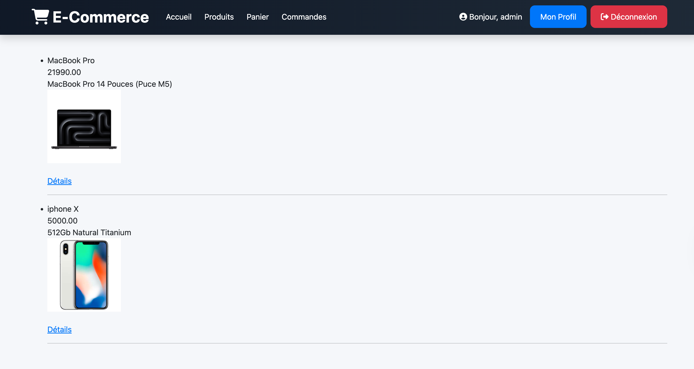
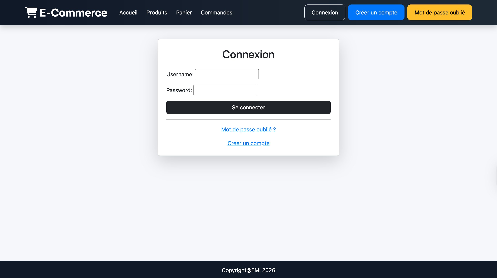
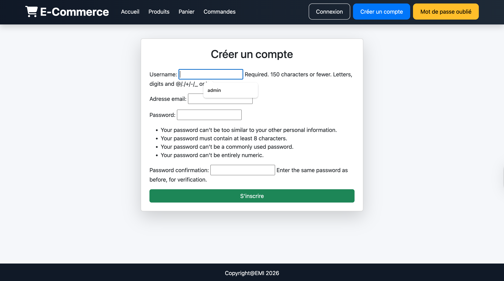
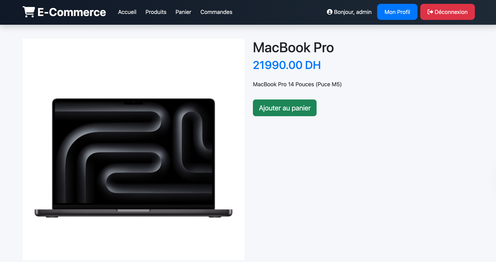
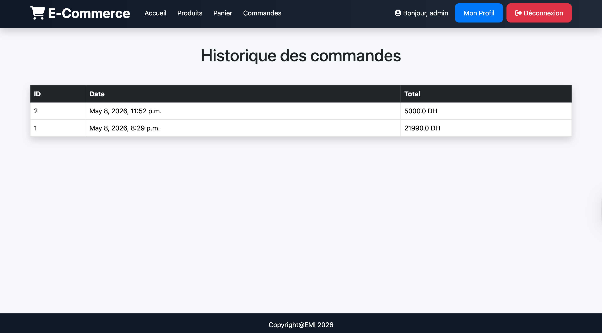
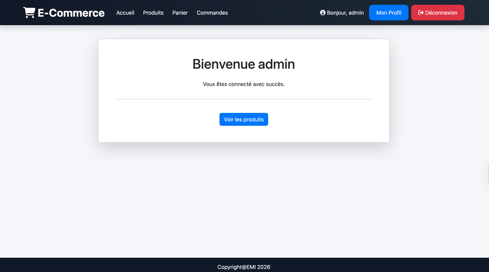
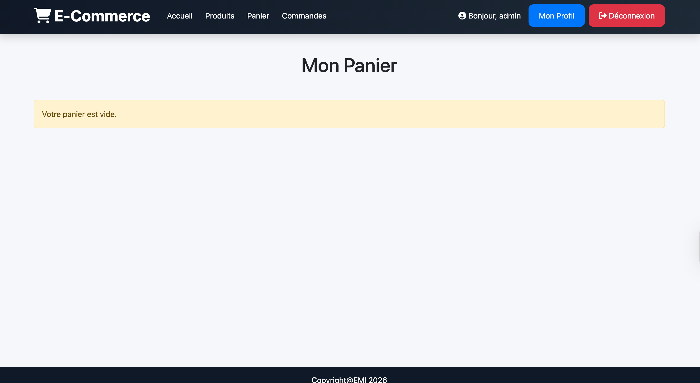
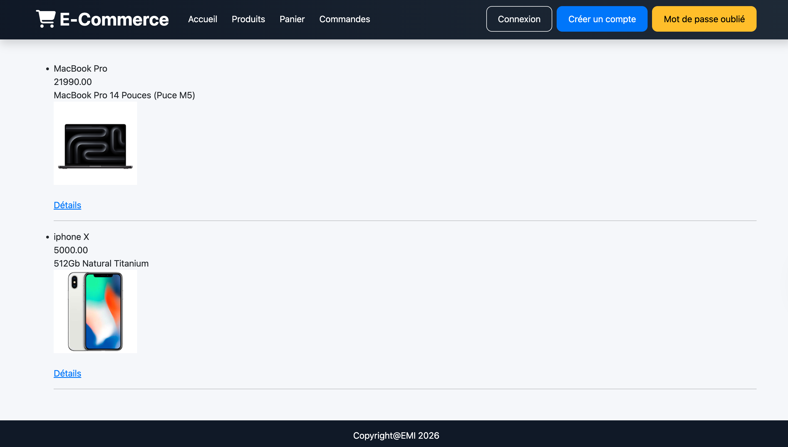

# Projet E-Commerce Django

Mini application e-commerce développée avec Django.

## Fonctionnalités

- Authentification utilisateur
- Inscription
- Connexion / Déconnexion
- Réinitialisation du mot de passe
- Liste des produits
- Détail produit
- Ajout au panier
- Consultation du panier
- Passage de commande
- Historique des commandes
- Profil utilisateur
- Protection des vues avec login_required

## Technologies utilisées

- Python
- Django
- Bootstrap 5
- SQLite

## Installation

```bash
git clone https://github.com/VOTRE_USERNAME/ecommerce-django.git

cd ecommerce-django

python -m venv myenv

source myenv/bin/activate

pip install -r requirements.txt

python manage.py migrate

python manage.py runserver
```

# Aperçu de l'application

## Page d'accueil



---

## Page de connexion



---

## Page de création de compte



---

## Page détail produit



---

## Page historique des commandes



---

## Page mon profil



---

## Page panier



---

## Page panier réservé admin


---

## Page produits


